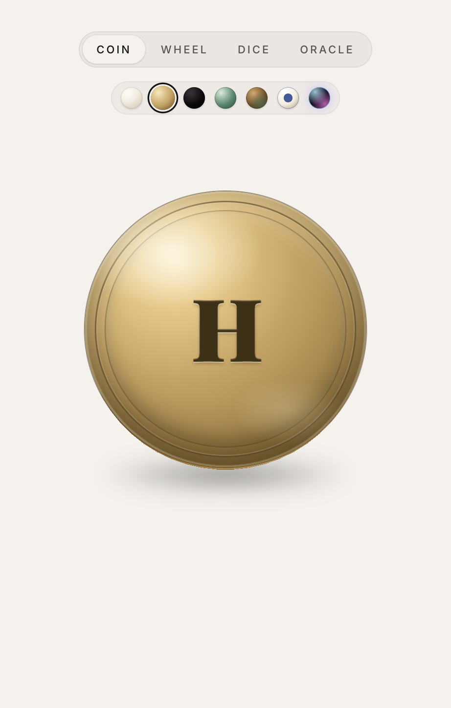
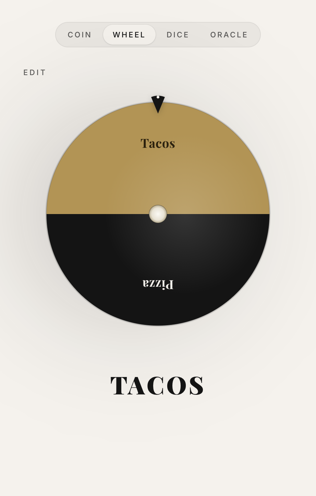
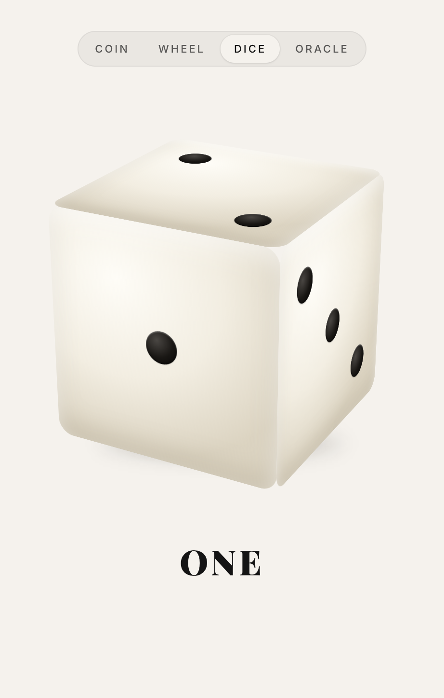
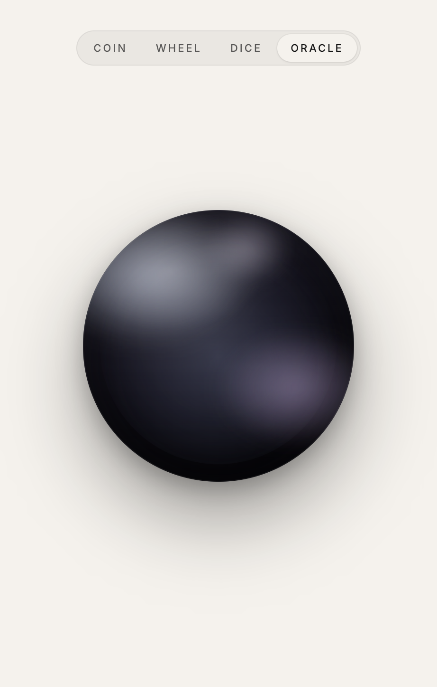

# coin

A minimalist decision-making app for iOS and macOS (via Mac Catalyst).

---

## What it looks like

<p align="center">
  
  &nbsp;
  
  <br />
  <sub>Coin &mdash; pick a finish, flip a weighted 3D coin. Wheel &mdash; up to eight labels, one spin.</sub>
</p>

<p align="center">
  
  &nbsp;
  
  <br />
  <sub>Dice &mdash; one D6 with a big readable result. Oracle &mdash; hold to ask, release for Yes / No / Maybe.</sub>
</p>

*Screenshots from the Vite dev server; layout and theming are the same in the native shell.*

---


---

## The volume twist (on device)

On iOS and Catalyst, a small Capacitor plugin reads `AVAudioSession.outputVolume` and turns it into notches (`round(outputVolume * 16)` on the default 16-step UI). The web build does not read real volume — the plugin falls back to a mid “random” level so you can develop in Chrome without surprises.

Rigging is implemented as pure functions in `src/lib/rigging.ts`. Rough cheat sheet:

- Coin: 0 notches (or muted) → always heads; 1 → always tails; 2+ → random.
- Wheel: 0 / muted → random; 1…8 → force that segment; 9+ → random.
- Dice and Oracle have their own notch→outcome tables (see `choice-prd.md` for the full matrix).


---

## Run locally (browser)

```bash
npm install
(cd plugins/system-volume && npm install && npx tsc)
npm run dev
```

Open the URL Vite prints (e.g. `http://localhost:5173/`). Volume rigging will not match a phone — use a device to feel the real behavior. Mobile browsers use device orientation after the browser's motion permission prompt:

- Coin: forward tilt = heads; back tilt = tails; flat = random.
- Wheel: tilt direction picks a wheel sector; flat = random.
- Dice: six tilt sectors map to faces 1...6; flat = random.
- Oracle: forward = yes; back = no; side = maybe; flat = random.

For local browser testing, add `?volumeNotches=0` through `?volumeNotches=16` to the URL; the value is remembered in `localStorage` for later flips.

---

## Run on iOS

You need full **Xcode** (not only Command Line Tools) and **CocoaPods**.

```bash
npm install
(cd plugins/system-volume && npm install && npx tsc)
npm run build
npx cap sync ios
npx cap open ios
```

In Xcode, pick a simulator or device and run. `cap sync` runs `pod install` and registers the System Volume plugin.

---

## Run on macOS (Mac Catalyst)

1. Open the iOS workspace (`npx cap open ios`), select the **App** target.  
2. Under **Supported Destinations**, add **Mac Catalyst** if it’s not there.  
3. Build and run with the **My Mac** destination.  

`AVAudioSession.outputVolume` is available on Catalyst, so volume-driven outcomes work like on iPhone.

---

## Project layout

```
src/
  App.tsx                 # Mode switcher, design persistence
  main.tsx, styles.css
  modes/                  # Coin, Wheel, Dice, Oracle screens
  components/              # Coin, Wheel, dice, ModeToggle, DesignPicker, Oracle, …
  lib/
    volume.ts             # Capacitor plugin + web fallback
    rigging.ts            # Pure “what should happen for this reading?”
    coinDesigns.ts
plugins/system-volume/    # Local Capacitor plugin (TypeScript + Swift)
ios/                      # Xcode project, pods, native shell
```

More product detail: **`choice-prd.md`**.

---

